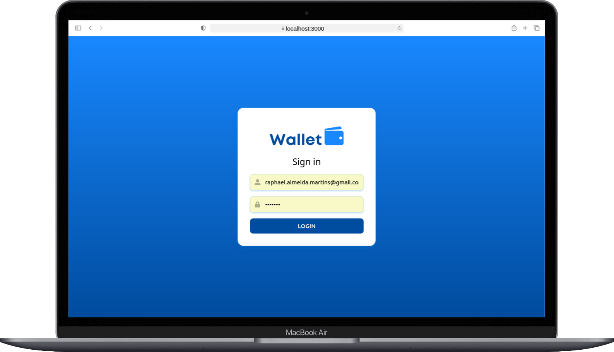
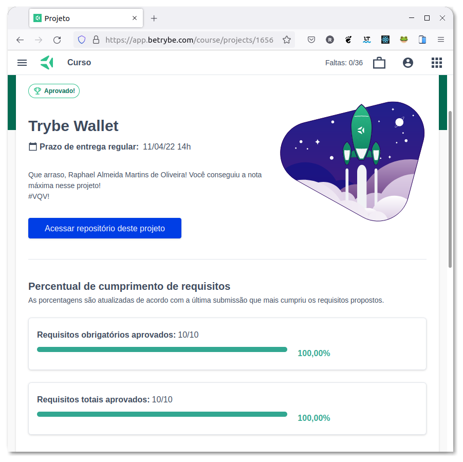

# :purse: TrybeWallet :moneybag:

## :page_with_curl: About/Sobre

  
<strong>:us: English</strong>
 

React project developed by [Raphael Martins](https://www.linkedin.com/in/raphaelameidamartins/) at the end of Unit 15 ([Front-end Development Module](https://github.com/raphaelalmeidamartins/trybe_exercicios/tree/main/2_Desenvolvimento-Front-end)) of Trybe's Web Development course. I was approved with 100% of the mandatory and optional requirements met.

We had to develop a wallet React application using the React Router, Redux and fetching currency exchange rates from a public API.

[Click here](https://raphaelalmeidamartins.github.io/trybewallet/) to check out the final version of the project on your browser.

 

  
<strong>:brazil: Português</strong>
 

Projeto React desenvolvido por [Raphael Martins](https://www.linkedin.com/in/raphaelameidamartins/) ao final do Bloco 15 ([Módulo Desenvolvimento Front-end](https://github.com/raphaelalmeidamartins/trybe_exercicios/tree/main/2_Desenvolvimento-Front-end)) do curso de Desenvolvimento Web da Trybe. Fui aprovado com 100% dos requisitos obrigatórios e opcionais atingidos.

Tivemos que desenvolver uma aplicação React de carteira usando React Router, Redux e consumindo dados de taxas de câmbio de uma API pública.

[Clique aqui](https://raphaelalmeidamartins.github.io/trybewallet/) para conferir a versão final do projeto no seu navegador.

 

## :man_technologist: Developed Skills/Habilidades Desenvolvidas

  
<strong>:us: English</strong>
 

* Develop a React application
* React to user interactions by manipulating the components' states and props according to user events
* Use the React Router library to handle page navigation
* Use the Redux library to handle state management
* Use the Redux thunk package to handle asynchronous actions
 

  
<strong>:brazil: Português</strong>
 

* Desenvolver uma aplicação React
* Reagir a interações do usuário manipulando os estados e propriedades dos componentes de acordo com eventos
* Usar a biblioteca React Router para lidar com navegação entre páginas
* Usar a biblioteca Redux para gerenciamento de estado
* Usar o pacote Redux thunk para lidar com actions assíncronas
 

## :memo: Methodologies/Metodologias

* Mobile First

## :hammer_and_wrench: Tools/Ferramentas

* HTML5
* CSS3
* JavaScript ES6+
* React.js
* React Icons (icon library)
* Redux
* Redux tunk
* GitHub Pages

## :trophy: Grade/Nota

### :copyright: Copyright disclaimer/Aviso de direitos autorais

  
<strong>:us: English</strong>
 

I developed this project for learning purposes, all the code and documentation texts are my authorship, and the rights belong exclusively to us. It is allowed to download or clone the repository for study purposes. However, it is not allowed to publish full or partial copies. This disclaimer does not cover libraries and dependencies, which are subject to their respective licenses.

We use the [AwesomeAPI](https://docs.awesomeapi.com.br/api-de-moedas) API to fetch the currencies' data.
 

  
<strong>:brazil: Português</strong>
 

Desenvolvi esse projeto para propósitos de aprendizagem, todo o código e documentação são de minha autoria e os direitos pertencem exclusivamente a mim. É permitido baixar ou clonar o repositório para fins de estudo. Contudo, não é permitido publicar cópias totais ou parciais. Este aviso não cobre bibliotecas e dependências, estas estão sujeitas a suas respectivas licenças.

Utilizamos a API [AwesomeAPI](https://docs.awesomeapi.com.br/api-de-moedas) para consumir dados de moedas.
 

