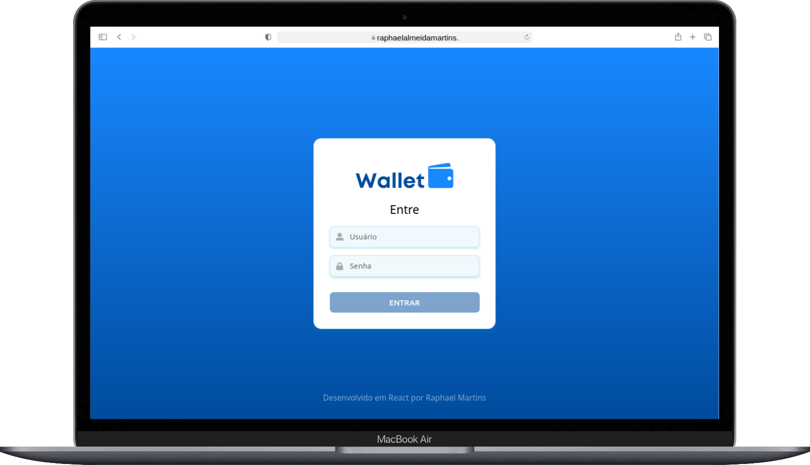

# :purse: TrybeWallet :moneybag:

## :page_with_curl: About

React project developed by [Raphael Martins](https://www.linkedin.com/in/raphaelameidamartins/) at the end of Unit 15 ([Front-end Development Module](https://github.com/raphaelalmeidamartins/trybe_exercicios/tree/main/2_Desenvolvimento-Front-end)) of Trybe's Web Development course. I was approved with 100% of the mandatory and optional requirements met.

We had to develop a wallet React application using the React Router, Redux and fetching currency exchange rates from a public API.

### Note

This project is still under development. I am implementing the layout, and I will refactor the code. I haven't deployed the application yet.

### In progress

- [ ] Finishing CSS
- [ ] Adding English translation (the project is currently only available in Brazilian Portuguese)

## :man_technologist: Developed Skills

* Develop a React application
* React to user interactions by manipulating the components' states and props according to user events
* Use the React Router library to handle page navigation
* Use the Redux library to create a global state

## :memo: Methodologies

* Mobile First

## :hammer_and_wrench: Tools

* HTML5
* CSS3
* JavaScript ES6+
* React.js
* React Icons (icon library)
* Redux
* GitHub Pages

## :trophy: Grade

### :copyright: Copyright disclaimer

I developed this project for learning purposes, all the code and documentation texts are my authorship, and the rights belong exclusively to us. It is allowed to download or clone the repository for study purposes. However, it is not allowed to publish full or partial copies. This disclaimer does not cover libraries and dependencies, which are subject to their respective licenses.
